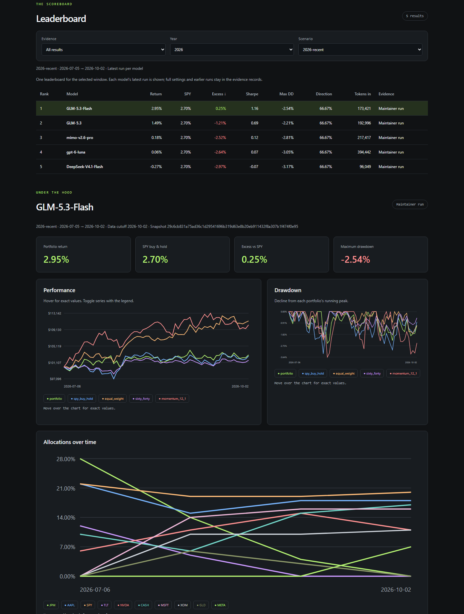

# BeatSPY

**One model. Five trading agents. Can it beat SPY?**

[](https://github.com/kingabzpro/beatspy/actions)
[](pyproject.toml)
[](LICENSE)

**[Open dashboard →](https://beatspy.vercel.app)** · [Contribution guide](CONTRIBUTING.md)



| Part | Purpose |
| :--- | :--- |
| **[Dashboard](dashboard/)** | Static HTML, CSS, and JavaScript on Vercel. Browse reviewed results and their evidence. |
| **Python CLI** | Run benchmarks locally, freeze market data, replay scores, and prepare contributions. |

Research, analyst, and forecasting agents work in parallel, followed by a critic
and portfolio manager. Python handles trading, risk rules, baselines, and scoring.

> [!NOTE]
> Benchmarks use real model API calls and frozen market data. Python computes scores;
> replay validation checks the recorded decisions, trades, and accounting.

## Start a benchmark

Requires Python 3.11+ and [uv](https://docs.astral.sh/uv/).

```bash
git clone https://github.com/kingabzpro/beatspy.git
cd beatspy
uv sync
uv run beatspy setup                 # endpoint, model, and API key
uv run beatspy doctor
uv run beatspy run                   # default: recent 2026 window
uv run beatspy report --open         # local dashboard; Ctrl+C to stop
```

Any OpenAI-compatible endpoint with tool calling works, including local servers.
Keys stay in `~/.beatspy/secrets.env` or environment variables. Local runs stay local.

| Scenario | Evaluation window |
| :--- | :--- |
| `2026-recent` **default** | Latest 90 calendar days through a completed NYSE session in 2026. |
| `2025-recent` | Final 90 calendar days through the last 2025 session. |
| Historical | `2020-covid`, `2022-bear`, `2023-recovery`. |

Fresh sessions create immutable snapshots. Extra history warms up indicators;
only the selected window is scored. One leaderboard shows the latest run per model
for the selected window. **All years** averages the latest yearly results per model;
exact data and settings remain downloadable.

```bash
uv run beatspy run --scenario 2025-recent --scenario 2026-recent \
  --model model-a --model model-b --jobs 2 --concurrency 6
uv run beatspy compare
uv run beatspy demo                  # clearly labeled synthetic preview
```

## Contribute a result

1. Check `uv run beatspy validate --run results/<run-id>`.
2. Prepare `uv run beatspy submit --run results/<run-id>` and review `dashboard/data/`.
3. Commit only the exported artifacts in your fork and open a PR.

**Community submitted** means the recorded decisions, trades, and scores replay.
**Maintainer run** identifies a separately generated, owner-controlled run.
The dashboard shows GLM, GLM Flash, DeepSeek, GPT-6 Luna, and MiMo 2.6 Pro
maintainer runs for 2025 and 2026, with all five models on one board per year.
It opens on the latest year; complete decisions, trades, and frozen prices are downloadable.
Explore model costs, running spend, and agent/token breakdowns with editable price rates.

<details>
<summary><strong>Optional integrations</strong></summary>

Finnhub news and Olostep search use optional keys and scenario flags.
Current fundamentals and live search carry look-ahead risks; event feeds are sparse.
Chronos: `uv sync --extra chronos`. TimeGPT: `uv sync --extra timegpt` plus a key.
The default statistical forecaster needs neither.

</details>

## Develop

```bash
uv sync --extra dev
uv run --no-sync pytest
uv run --no-sync ruff check .
uv run --no-sync ruff format --check .
node --test tests/dashboard.test.cjs
uv build
```

Tests use scripted agents; live integrations are opt-in. Node is only needed for JS tests.
See [CONTRIBUTING](CONTRIBUTING.md) for browser checks, freshness, trust, and deployment.

[Architecture](ARCHITECTURE.md) · [Apache-2.0](LICENSE)
