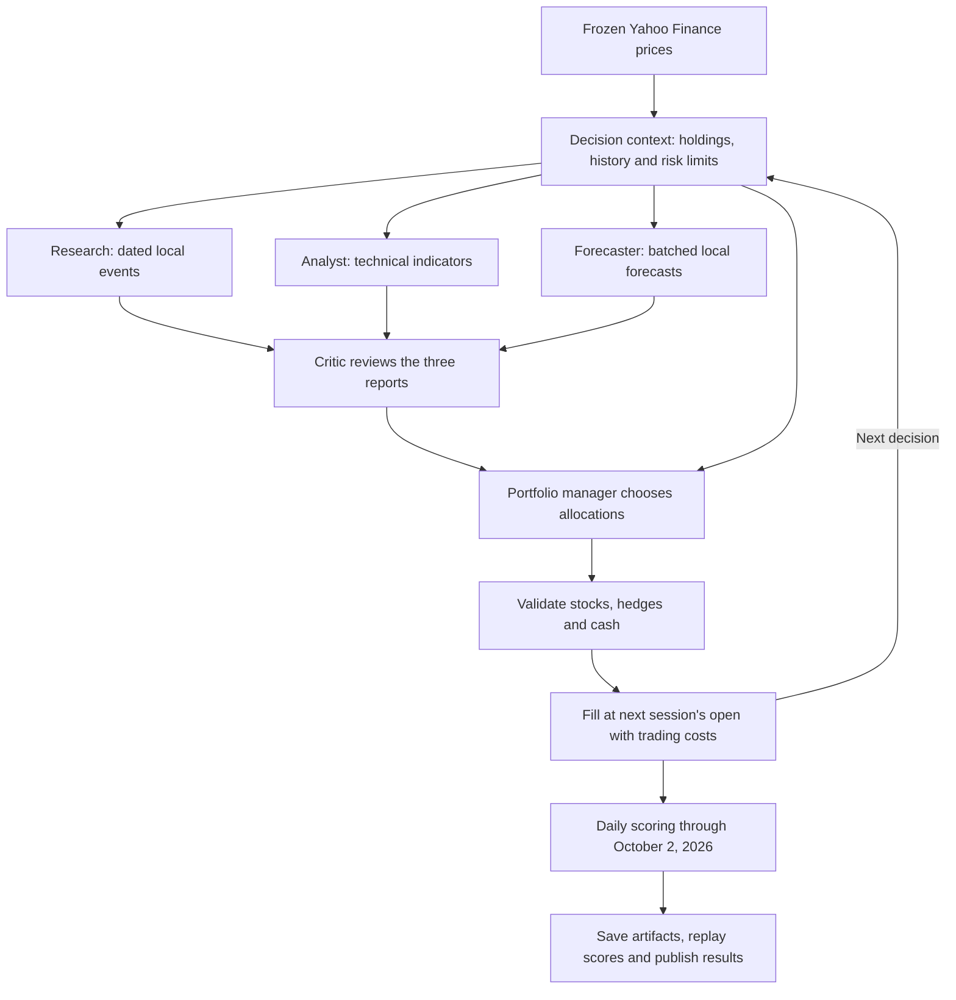

# BeatSPY

**Three decision cadences. One six-month window. Can AI beat SPY?**

[Open dashboard →](https://beatspy.vercel.app) · [Contribution guide](CONTRIBUTING.md)

BeatSPY compares model-controlled portfolios with SPY using frozen historical
prices. The **six-month family** runs three versions over the same window
(April 6–October 2, 2026) so that the only difference between them is how often
the model is allowed to trade:

| Version | Cadence | Decisions | Rule |
|---|---|---:|---|
| V1 · Buy once | one decision | 1 | Fund ≥22 names at the start, then hold |
| V2 · Monthly | monthly | 7 | Rebalance at each month-end |
| V3 · Weekly | weekly | 24 | Trade weekly, with gold/oil/bond hedges |

All three share one frozen snapshot, a 24-stock universe spanning 11 sectors,
and the same accounting. SPY is comparison-only and cannot be bought. See the
[six-month comparison](docs/six-month-comparison.md) for the design and its
limitations.

The default `2026-comparison` scenario preserves the earlier five-agent
workflow with 12 decisions over July 6–October 2, 2026. Its latest six-model
batch had **5 of 6 models beat SPY's 2.70% return**, while the non-model momentum
baseline returned 12.62% and outperformed every model. See the
[12-decision comparison](docs/12-decision-comparison.md) for results, runtimes,
and cost estimates.

## How it works



Research, analysis, and forecasting run in parallel. The portfolio manager
receives their reports, the critic's review, and a feasible reference candidate;
it retains control of allocations. The candidate is not a required portfolio.
Version 1 receives no reference and no performance feedback, so it must originate
its own portfolio.

| Six-month setting | Value |
| --- | --- |
| Scenarios | `2026-6m-buyhold`, `2026-6m-monthly`, `2026-6m-weekly` |
| Scored period | April 6–October 2, 2026, identical in all three |
| Decisions | 1, 7, and 24 respectively |
| Individual stocks | 24 companies across 11 sectors |
| Hedges and cash | GLD, USO, TLT, cash |
| Benchmark | SPY, comparison-only; models cannot buy it |
| Data and forecasts | One shared frozen snapshot and local statistical forecasts |
| Research services | No Olostep, Finnhub, or TimeGPT calls |

| Default setting | Value |
| --- | --- |
| Scenario | `2026-comparison` |
| Scored period | July 6–October 2, 2026 |
| Decisions | 12, selected across weekly candidate dates |
| Individual stocks | AAPL, MSFT, NVDA, META, JPM, XOM |
| Hedges and cash | TLT, GLD, cash |
| Benchmark | SPY, comparison-only; models cannot buy it |
| Data and forecasts | Cached Yahoo adjusted prices and local statistical forecasts |
| Research services | No Olostep, Finnhub, or TimeGPT calls by default |

Warmup history is excluded from scoring. This fixed surviving stock basket has
survivorship bias, and models may already know historical outcomes. The period
has also been used during development; these scores are not an untouched holdout.

Because the three versions differ only in decision cadence, a return gap between
them reflects the number and timing of decisions and their costs, not a
different universe or scoring rule. They are **not** leaderboard-eligible: only
`2026-comparison` accepts a trusted verification request.

## Run a benchmark

Install Python 3.11+ and [uv](https://docs.astral.sh/uv/), then:

```bash
git clone https://github.com/kingabzpro/beatspy.git
cd beatspy
uv sync
uv run beatspy setup
uv run beatspy run
uv run beatspy results
uv run beatspy report --open
```

The five-agent workflow requires an OpenAI-compatible endpoint with tool calling. To avoid setup prompts:

```bash
uv run beatspy setup --model your-model --base-url https://your-endpoint/v1 --api-key-env YOUR_MODEL_KEY
```

For a shorter local experiment, use `uv run beatspy run --max-decisions 6`.
The cap selects fewer dates across the same period; it does not add dates beyond
the scenario's schedule. `--model`, `--jobs`, and `--concurrency` control model
selection and parallel work. Decisions within one portfolio remain sequential.

To run the six-month family, name its scenarios explicitly:

```bash
uv run beatspy run --scenario 2026-6m-buyhold --scenario 2026-6m-monthly --scenario 2026-6m-weekly
```

Each agent has at most three tool calls, eight turns, and 4,096 output tokens
per decision. Requests time out after 90 seconds without automatic retries.
Twelve decisions can require more than twelve model requests. Failed portfolio
decisions retain the previous allocation, with errors recorded in the artifacts.

`--scenario 2026-ytd` is a separate full-year, single-call experiment with
23 companies across 11 sectors. Optional research integrations, including the
local Olostep trial, are described in the [contribution guide](CONTRIBUTING.md).
The dashboard shows the latest execution per model **and per version**, each with
its exact period, so the three cadences are never collapsed into one row.

## Submit in one command

```bash
uv run beatspy submit --send
# Or run and request verification together:
uv run beatspy run --submit
```

Install and authenticate [GitHub CLI](https://cli.github.com/) first. Submission
validates the latest real run and sends a verification request; it never shares
API keys. `beatspy submit` prepares the request locally without sending it.
The dashboard's **Submit for verification** button opens a prefilled request too.

The trusted main-branch workflow reruns approved models, checks code integrity,
replays scores, and signs exported artifacts with the owner's Ed25519 private
key before preparing a results PR. The public key validates the signature;
a unique verification ID binds the result to its source and execution.

**The current six results are replay-checked but unsigned.** Trusted signing
requires the owner's key configuration, documented in
[Owner setup](CONTRIBUTING.md#owner-setup-once). Local runs remain unsigned;
a trusted rerun may produce different scores.

## Development

```bash
uv sync --extra dev --extra browser
uv run --no-sync pytest
uv run --no-sync ruff check .
uv run --no-sync ruff format --check .
node --test tests/dashboard.test.cjs
uv build
```

Browser tests require `uv run playwright install chromium`. Ordinary tests use
scripted agents; live forecast checks are opt-in. Generated runs and market
caches are ignored by Git; published dashboard artifacts retain their frozen
prices and provenance for replay.

[Architecture](ARCHITECTURE.md) · [Six-month comparison](docs/six-month-comparison.md) · [12-decision comparison](docs/12-decision-comparison.md) · [Contribution guide](CONTRIBUTING.md) · [Apache-2.0](LICENSE)
