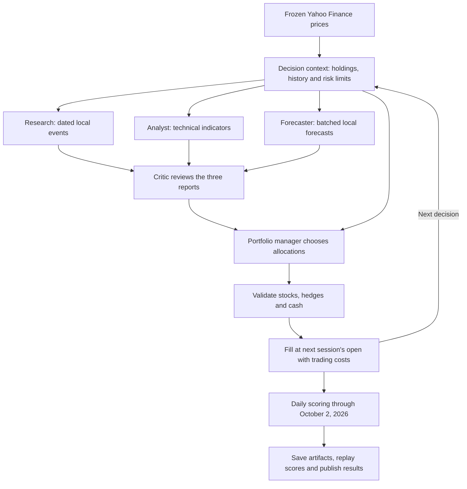

# BeatSPY

**Five trading agents. Twelve decisions. Can they beat SPY?**

[Open dashboard →](https://beatspy.vercel.app) · [Contribution guide](CONTRIBUTING.md)

BeatSPY compares model-controlled portfolios with SPY using frozen historical
prices. The default preserves the earlier five-agent workflow, with 12 decisions
over **July 6–October 2, 2026**. Python validates allocations, executes trades,
and scores the portfolio daily through the end of the period.

The latest six-model batch had **5 of 6 models beat SPY's 2.70% return**.
The non-model momentum baseline returned 12.62%, outperforming every model.
See the [full comparison](docs/12-decision-comparison.md) for results, runtimes,
cost estimates, and differences from the original four-decision archive.

## How it works



Research, analysis, and forecasting run in parallel. The portfolio manager
receives their reports, the critic's review, and a feasible momentum candidate;
it retains control of allocations. The candidate is not a required portfolio.

| Default setting | Value |
| --- | --- |
| Scenario | `2026-comparison` |
| Scored period | July 6–October 2, 2026 |
| Decisions | 12, selected across weekly candidate dates |
| Individual stocks | AAPL, MSFT, NVDA, META, JPM, XOM |
| Hedges and cash | TLT, GLD, cash |
| Benchmark | SPY, comparison-only; models cannot buy it |
| Data and forecasts | Cached Yahoo adjusted prices and local statistical forecasts |
| Research services | No Olostep, Finnhub, or TimeGPT calls by default |

Warmup history is excluded from scoring. This fixed surviving stock basket has
survivorship bias, and models may already know historical outcomes. The period
has also been used during development; these scores are not an untouched holdout.

## Run a benchmark

Install Python 3.11+ and [uv](https://docs.astral.sh/uv/), then:

```bash
git clone https://github.com/kingabzpro/beatspy.git
cd beatspy
uv sync
uv run beatspy setup
uv run beatspy run
uv run beatspy results
uv run beatspy report --open
```

The five-agent workflow requires an OpenAI-compatible endpoint with tool calling. To avoid setup prompts:

```bash
uv run beatspy setup --model your-model --base-url https://your-endpoint/v1 --api-key-env YOUR_MODEL_KEY
```

For a shorter local experiment, use `uv run beatspy run --max-decisions 6`.
The cap selects fewer dates across the same period; it does not add dates beyond
the scenario's schedule. `--model`, `--jobs`, and `--concurrency` control model
selection and parallel work. Decisions within one portfolio remain sequential.

Each agent has at most three tool calls, eight turns, and 4,096 output tokens
per decision. Requests time out after 90 seconds without automatic retries.
Twelve decisions can require more than twelve model requests. Failed portfolio
decisions retain the previous allocation, with errors recorded in the artifacts.

`--scenario 2026-ytd` is a separate full-year, single-call experiment with
23 companies across 11 sectors. Optional research integrations, including the
local Olostep trial, are described in the [contribution guide](CONTRIBUTING.md).
The dashboard shows only the latest execution per model and its exact period.

## Submit in one command

```bash
uv run beatspy submit --send
# Or run and request verification together:
uv run beatspy run --submit
```

Install and authenticate [GitHub CLI](https://cli.github.com/) first. Submission
validates the latest real run and sends a verification request; it never shares
API keys. `beatspy submit` prepares the request locally without sending it.
The dashboard's **Submit for verification** button opens a prefilled request too.

The trusted main-branch workflow reruns approved models, checks code integrity,
replays scores, and signs exported artifacts with the owner's Ed25519 private
key before preparing a results PR. The public key validates the signature;
a unique verification ID binds the result to its source and execution.

**The current six results are replay-checked but unsigned.** Trusted signing
requires the owner's key configuration, documented in
[Owner setup](CONTRIBUTING.md#owner-setup-once). Local runs remain unsigned;
a trusted rerun may produce different scores.

## Development

```bash
uv sync --extra dev --extra browser
uv run --no-sync pytest
uv run --no-sync ruff check .
uv run --no-sync ruff format --check .
node --test tests/dashboard.test.cjs
uv build
```

Browser tests require `uv run playwright install chromium`. Ordinary tests use
scripted agents; live forecast checks are opt-in. Generated runs and market
caches are ignored by Git; published dashboard artifacts retain their frozen
prices and provenance for replay.

[Architecture](ARCHITECTURE.md) · [Contribution guide](CONTRIBUTING.md) · [Apache-2.0](LICENSE)
