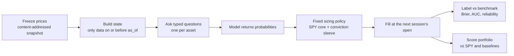

<div align="center">

# BeatSPY

**Decision models, not chat models.**

Six decision models read one frozen point-in-time market state, answer the same
typed probability questions, and are scored twice: were the probabilities
calibrated, and did the portfolio they built beat SPY?

[Live dashboard](https://beatspy.vercel.app) · [Architecture](ARCHITECTURE.md) · [Roadmap](ROADMAP.md) · [Contributing](CONTRIBUTING.md)

[](https://github.com/kingabzpro/beatspy/actions/workflows/ci.yml)
[](pyproject.toml)
[](LICENSE)
[](#the-models)

</div>

> [!IMPORTANT]
> **The honest result.** In the published window no model beat SPY, and no model's
> probabilities show measurable skill: every Brier skill is negative and every AUC
> permutation p-value is far from significant. That window also punished the
> scenario's own momentum selection, so the table's most useful line is the one
> that compares each model against simply holding the names it was given.

## Latest benchmark

Rolling six months to the latest completed session (`2026-6m`), weekly decisions,
frozen adjusted prices, window 2026-04-09 to 2026-10-09. The pool is 25 assets:
large companies across all 11 sectors, plus broad equities and long Treasuries.
The book spreads across all of them by conviction; SPY is the yardstick and is
never held, under any policy. Each decision sees the pool's trailing hit rate as
a calibration anchor, and trades only when a weight moves more than the
rebalance band, so weekly noise does not become fees.

| Decision model | Return | vs pool | vs SPY | Excess 95% CI | Sharpe | Max DD | Turnover | Brier skill | AUC | p(AUC) |
| --- | --- | --- | --- | --- | --- | --- | --- | --- | --- | --- |
| `gpt-6-luna` | **+9.84%** | **+0.75%** | −5.25% | [−17.88%, +6.73%] | 1.92 | −3.16% | 15.3% | −0.019 | 0.476 | 0.56 |
| `clef` | +9.82% | +0.73% | −5.27% | [−17.73%, +5.89%] | 1.89 | −3.38% | 17.9% | −0.268 | 0.502 | 0.21 |
| `clef-flash` | +9.78% | +0.69% | −5.31% | [−16.40%, +5.35%] | 1.88 | −3.73% | 18.0% | −0.309 | 0.490 | 0.47 |
| `jev-latest` | +8.29% | −0.80% | −6.80% | [−17.42%, +2.83%] | 1.67 | −2.82% | 19.6% | −0.064 | 0.478 | 0.54 |
| `pplx-decider` | +8.16% | −0.93% | −6.93% | [−19.43%, +4.28%] | 1.64 | −3.32% | 21.3% | −0.195 | 0.476 | 0.51 |
| `ms-decision-1` | +5.96% | −3.13% | −9.13% | [−21.87%, +2.75%] | 1.21 | −3.32% | 28.4% | −0.642 | 0.472 | 0.74 |
| *pool, equal weight* | *+9.09%* | *n/a* | *−6.00%* | *n/a* | *n/a* | *n/a* | *n/a* | *n/a* | *n/a* | *n/a* |
| *60/40, benchmark and Treasuries* | *+5.19%* | *n/a* | *−9.90%* | *n/a* | *n/a* | *n/a* | *n/a* | *n/a* | *n/a* | *n/a* |
| *12-1 momentum, top 3* | *−0.26%* | *n/a* | *−15.35%* | *n/a* | *n/a* | *n/a* | *n/a* | *n/a* | *n/a* | *n/a* |
| *SPY buy-and-hold* | *+15.09%* | *n/a* | *n/a* | *n/a* | *n/a* | *n/a* | *n/a* | *n/a* | *n/a* | *n/a* |

Read it honestly:

- **The return is the pool's beta, not forecasting.** Equal weight over the same
  25 names made +9.09%; the models finished within a point of that, three of them
  slightly ahead. Nothing here suggests the probabilities know which asset wins
  next week: every Brier skill is negative and every AUC p-value is far from
  significant.
- **What actually improved the number was removing a drag.** A trailing-performer
  filter, held equally with no model input, returned −0.94% at twelve names and
  +5.31% at twenty against +9.09% for the whole pool, so it is off. Volatility
  weighting lost too (+6.03%). The filter remains a scenario knob, and the README
  records the measurements below.
- **Turnover is the other cost**, and the rebalance band is why it fell from
  ~50% under the earliest policy to 15 to 20% here.
- **Against SPY the book still lags**, because SPY is cap-weighted and this book
  is not. That gap is structural and is why the pool line sits beside it.

<details>
<summary><b>Every design that was measured, and what it returned</b></summary>

All figures are equal weight over the stated universe, on the same window, so
the design is on trial and no model is involved:

| Design | Return | Turnover |
| --- | --- | --- |
| Whole pool, equal weight | **+9.09%** | 3.3% |
| Whole pool, inverse volatility | +6.03% | 3.9% |
| Top 20 trailing performers | +5.31% | 6.9% |
| Top 12 trailing performers | −0.94% | 13.6% |
| Top 3 by 12-1 momentum (built-in reference) | −0.26% | 11% |
| SPY buy-and-hold | +15.09% | n/a |

Momentum filtering at 3, 6 and 9-month lookbacks and top 8 through 20 all landed
below the pool in this window, and the narrower the filter, the worse it did.
The pool is mega-caps, so the honest reading is that this window rewarded
breadth, and the current design refuses to bet on a filter that has not earned
its place.

</details>

<details>
<summary><b>What the models were given to work with</b></summary>

- **A calibration anchor.** Every state carries the pool's trailing hit rate
  against the benchmark (`base_rate`): on 2026-06-05, for example, only 30.8% of
  names had beaten SPY over the previous quarter. A model answering 0.5 for a
  typical name is contradicting a number it can see.
- **Every question form.** `--form all` asks each asset three ways: a yes/no
  probability, a two-way choice, and a five-level severity judgement. The sizing
  signal can average them (`signals = "consensus"`), which shrinks a position
  when the forms disagree. The published runs use the single-form signal, which
  measured no worse.
- **A rebalance band.** Weights inside the band are left exactly as they are.

</details>

## The models

| Model | Provider | Endpoint | Input price |
| --- | --- | --- | --- |
| `gpt-6-luna` | OpenAI [Decisions API](https://developers.openai.com/api/docs/guides/decisions) (public beta) | `api.openai.com/v1/decisions` | $0.10 / 1M |
| `jev-latest` | [TypeSafe Jev](https://docs.typesafe.ai/api-reference) | `api.typesafe.ai/v1/systemone` | $0.042 / 1M |
| `clef` | Cloudflare [Clef](https://developers.cloudflare.com/workers-ai/models/clef/) (27B) | Workers AI | $0.24 / 1M |
| `clef-flash` | Cloudflare Clef-flash (9B) | Workers AI | $0.09 / 1M |

All four bill **input tokens only**: output is free because there is no output
text, and none offers prompt caching (pricing checked 2026-10-08). One run asks
one question per asset and one call answers them all, so a complete 25-week
benchmark of all six models costs about **$0.11**.

Two routers serve decision models from other providers, and the benchmark speaks
their contract directly (verified live 2026-10-12):

| Model | Route | Upstream | Input price |
| --- | --- | --- | --- |
| `requesty-clef` | Requesty `/v1/decisions` | Sference Clef | $0.24 / 1M |
| `openrouter-pplx-decider` | OpenRouter | Perplexity Decider 27B v1.1 | $0.02 / 1M |
| `openrouter-solar-decide` | OpenRouter `/api/alpha/decisions` | Upstage Solar Decide | $0.05 / 1M |
| `openrouter-mercury-decide` | OpenRouter | Inception Mercury Decide | $0.02 / 1M |
| `openrouter-jev-1-13` | OpenRouter | TypeSafe Jev 1.13, pinned | $0.042 / 1M |
| `openrouter-microsoft-decision-1` | OpenRouter | Microsoft Decision 1 | $0.042 / 1M |
| `openrouter-liquid-d1` | OpenRouter | Liquid D1 | $0.04 / 1M |

`openrouter.ai/api/v1/models?output_modalities=decisions` is the live list, and
on 2026-10-12 it served nineteen decision models, several with free tiers. Two
caveats worth knowing: OpenAI and TypeSafe expose native decision heads, while
Anthropic and Google emulate them with structured output (their P(true) is a
prompted estimate and their choice and score answers carry no distribution), so
the emulated routes are not in the table yet.

## Quick start

```bash
git clone https://github.com/kingabzpro/beatspy.git
cd beatspy
uv sync --extra dev
uv run beatspy setup                 # pick a model and store its key
uv run beatspy run --model clef-flash --scenario 2026-6m
uv run beatspy report --open         # render the dashboard locally
```

No keys yet? `uv run beatspy demo` builds synthetic runs and renders the same
dashboard offline. `uv run beatspy models` shows which credentials resolve, and
`uv run beatspy doctor --probe` makes one live call per model.

## How it works


```mermaid
flowchart LR
    A["Freeze prices<br/>content-addressed snapshot"] --> B["Build state<br/>only data on or before as_of"]
    B --> C["Ask typed questions<br/>one per asset"]
    C --> D["Model returns probabilities"]
    D --> E["Fixed sizing policy<br/>SPY core + conviction sleeve"]
    E --> F["Fill at the next session's open"]
    F --> G["Label vs benchmark<br/>Brier, AUC, reliability"]
    F --> H["Score portfolio<br/>vs SPY and baselines"]
```

<details>
<summary><b>One decision, step by step</b></summary>

1. The scenario resolves its dates and loads a content-addressed snapshot, or
   freezes a new one; a 15-minute buffer keeps unfinished sessions out.
2. The state is built from data dated on or before the decision date only, and
   kept inside a token budget that is enforced, not assumed.
3. The model returns one typed answer per question: `noul` (a yes/no
   probability), `choice`, or `score`. Refusals and missing answers are recorded
   as missing coverage, never invented.
4. The fixed policy turns the probabilities into target weights. The model never
   states an allocation.
5. Orders fill at the next session's open. Every probability is then labeled by
   whether that asset actually beat the benchmark over the same horizon.

</details>

<details>
<summary><b>How probabilities become a portfolio</b></summary>

The default policy is **graded_cs**: the whole book spreads across the
investable set, half evenly and half by each probability's distance above the
decision's own mean, so the same ranking produces the same weights under any
scale a provider answers on. A scenario may narrow the investable set to its
strongest trailing performers (`selection_top`); the ranking is point-in-time and
the report adds an equal-weight line for that same set, so the rule's own return
stays visible instead of being credited to the model.

The index is never investable under any policy: SPY is the yardstick the labels
and the comparison are measured against. `graded` (conviction above a fixed 0.5
prior) and `top_n` (the earliest top-three cut) stay selectable so recorded runs
remain reproducible, and under every graded policy an unanswered question carries
no conviction share, so a provider failure can never become a directional bet.

</details>

<details>
<summary><b>How it is scored</b></summary>

**Calibration.** Each probability is labeled by whether the asset beat the
benchmark over the horizon, a relative outcome, so a rising market cannot mark
every prediction correct. Per form: Brier, Brier skill against a constant at the
sample rate, log loss, tie-aware AUC, accuracy, and 10-bin reliability with
expected and maximum calibration error. `miscalibration_gap` compares the noul
and choice forms on the same question and is reported only when a run asks both
(`--form twin` or `all`).

**P&L.** The portfolio runs through the same accounting engine, on the same
frozen prices, against SPY buy-and-hold and three deterministic references:
equal weight, 60/40, and 12-minus-1 momentum. Sharpe uses a zero risk-free rate
(`risk_free_annual = 0.0`), recorded per run.

**Uncertainty.** Samples are clustered by decision date, so a run's effective
sample is closer to its number of decisions than to its number of predictions.
`metrics.json` carries a 95% block-bootstrap interval for the return and for the
paired excess over SPY, and a two-sided permutation p-value for each signal's
Brier skill and AUC, with outcomes shuffled within decision dates. Both are
seeded, so replay reproduces them exactly.

</details>

<details>
<summary><b>What one window can prove</b></summary>

`examples/power_analysis.py` simulates the benchmark's own tests. For a book with
about 1% daily volatility, the share of runs whose 95% interval excludes a true
excess of a given size:

| Decision windows | 2%/yr | 5%/yr | 10%/yr | 20%/yr |
| --- | --- | --- | --- | --- |
| 25 (the published run) | 6% | 6% | 7% | 14% |
| 50 | 5% | 6% | 10% | 26% |
| 100 | 4% | 6% | 14% | 44% |
| 250 | 5% | 8% | 28% | 79% |

A six-month, 25-decision benchmark cannot separate a 20%/year edge from luck;
roughly 250 weekly windows are needed for 80% power at that effect size. The
table describes the sample, it does not test the model.

For calibration at the observed probability spread (sd about 0.05), the two
p-values behave very differently, which is why every signal reports both. A
perfectly calibrated informative model (AUC 0.55) is rejected by the Brier-skill
test only 3% of the time even at 100 windows, because the Brier score is
dominated by its calibration term near 0.5; the AUC test finds the same model 68%
of the time at 25 windows. In short: read `auc_p_value` when probabilities sit
near 0.5. And Brier alone cannot say which way a model is wrong: it is invariant
under flipping both the probability and the outcome distribution, so reliability
bins and accuracy are what separate "confidently wrong" from "hedging".

</details>

<details>
<summary><b>Trust: replay, no look-ahead, no credentials in the dashboard</b></summary>

- `beatspy verify` replays a finished run offline: artifact hashes, the snapshot
  manifest, the decision schedule, and the recorded weights through the
  accounting engine, and requires exact agreement with the stored metrics.
- `examples/leakage_audit.py` is an adversarial check: it tampers with every
  price after a run's midpoint and requires every earlier decision to be
  byte-identical while later ones change. On the published runs, 12 of 12
  pre-cut decisions were identical and 13 of 13 post-cut decisions changed.
- Prices are frozen into content-addressed snapshots; the state contains only
  data dated on or before the decision date, and the token budget is enforced
  before the state is sent.
- The dashboard contains no credentials and reads reviewed JSON artifacts only.

</details>

<details>
<summary><b>Commands</b></summary>

```bash
uv run beatspy run --model clef-flash clef jev-latest gpt-6-luna --scenario 2026-6m
uv run beatspy run --model gpt-6-luna --max-decisions 12
uv run beatspy run --model clef --form all        # ask every question form
uv run beatspy run --max-cost-usd 0.05            # abort a run that would overspend
uv run beatspy state --scenario 2026-6m           # what a decision would read, and its token cost
uv run beatspy calibrate <run-id>                 # calibration table for one run
uv run beatspy verify results/<run-id>            # offline replay of a finished run
uv run beatspy compare                            # latest run per decision model
```

</details>

<details>
<summary><b>Requirements and credentials</b></summary>

- Python 3.11+ and [uv](https://docs.astral.sh/uv/). Dependencies: pydantic,
  pandas, numpy, httpx, exchange-calendars, yfinance.
- A key for whichever model you run. TypeSafe needs `TYPESAFE_API_KEY`; OpenAI
  needs `OPENAI_API_KEY`; Cloudflare needs `CLOUDFLARE_ACCOUNT_ID` plus
  `CLOUDFLARE_AUTH_TOKEN`. Each also has a `BEATSPY_`-prefixed form that wins.
- Keys come from the environment, a project `.env`, or `~/.beatspy/secrets.env`.
  `.env` is git-ignored and never imported by the dashboard.
- Everything is HTTP-based, so the Clef path works through the Workers AI REST
  endpoint with no Worker or TypeScript build step.

</details>

<details>
<summary><b>Development</b></summary>

```bash
uv sync --extra dev
uv run --no-sync pytest              # 270+ tests, no network and no credentials
uv run --no-sync ruff check .
node --test tests/dashboard.test.cjs
uv run python examples/leakage_audit.py   # adversarial look-ahead audit on a finished run
```

The suite is hermetic: a scripted offline client answers every question form, so
complete runs are executed, scored, replayed, rendered, and audited inside the
tests.

</details>

## License

Apache-2.0. See [LICENSE](LICENSE).
